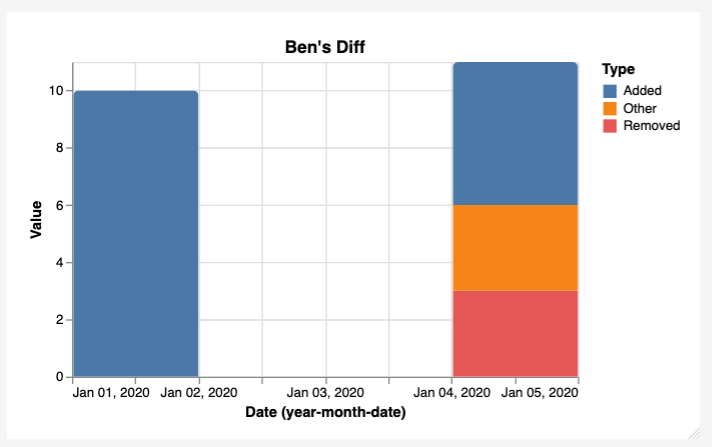
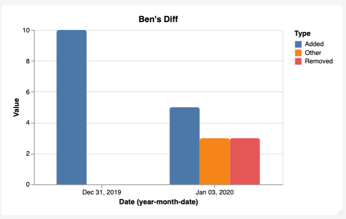
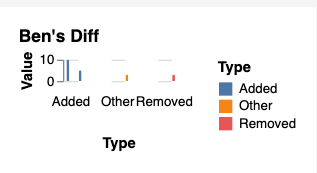

# tablegraph

Create graphs from CSVs

## Project Status (2025-06-14)

Not actively developed - I'm not really using `tablegraph` anymore- the graphs didn't look as good as I'd hoped and I found Observable Framework, which is pretty nice. I'm watching issues; please open one for any questions and especially BEFORE submitting a Pull Request.

## Install

- [Homebrew](https://brew.sh/): `brew install bbkane/tap/tablegraph`
- [Scoop](https://scoop.sh/):

```
scoop bucket add bbkane https://github.com/bbkane/scoop-bucket
scoop install bbkane/tablegraph
```

- Download Mac/Linux/Windows executable: [GitHub releases](https://github.com/bbkane/tablegraph/releases)
- Go: `go install go.bbkane.com/tablegraph@latest`
- Build with [goreleaser](https://goreleaser.com/) after cloning: `goreleaser --snapshot --skip-publish --rm-dist`

# Go + Vega-Lite Rewrite

## Problems with Python + Plotly

### Packaging.

I don't feel comfortable with Python's packaging ecoystem. I want to `brew install <tool>` reliably and I don't know how to get that with Python + dependencies.

Options:

- learn how to do Python + dependencies, probably by following Simon Willerson's work on DataSette. This seems to involve a somewhat complicated set of tools, but he's done most of the work. If I do this, I'm worried that the components will change over time and I'll have to keep on top of that. That does get me the `plotly` package instead of manually writing the JSON.
- Use a single Python file and only the stdlib. This is what I do now (and it's honestly not too bad), but I want more complext help than `argparse` can provide. TODO: see how I can do that
- Switch to Go. Go has a great packaging system I understand, and I could use my CLI library warg.

### Program Correctness / Tooling

Typs + Lints

Python has optional type hints that I use, but because I don't really run MyPy consistently, they function more like docs... that goes for a lot of Python tooling. All the best editors for Python are proprietary (Pylance, PyCharm).

Due to my single file choice, it's getting more difficult to add different types of graphs

Options:

- Python + dependencies
- Switch to Go

### Plotly JSON

Plotly uses fairly complex JSON to build charts. I want to add more types of charts, and I'm not looking forward to learning the right JSON for histograms, etc.

Options:

- Python + dependencies. This gets me the plotly library, which would help, but I'd still have to learn it.
- Switch to Vega, which uses CSV but might not be powerful enough.

## Vega-Lite unknowns

Vega/Vega-Lite *already* use CSV to make graphs

Let's seen if I can recreate what plotly gives me in `cashflow`... multiline chart, zoom, show nubmer at point, space filling chart, isolate a line

Also want histograms, bar and column charts.

Line chart: [Open the Chart in the Vega Editor](https://vega.github.io/editor/#/url/vega-lite/N4IgJAzgxgFgpgWwIYgFwhgF0wBwqgegIDc4BzJAOjIEtMYBXAI0poHsDp5kTykBaADZ04JAKyUAVhDYA7EABoQAEzjQATjRyZ289AGVMbKAGsABDk1Q1ZtgDMzYswBU4sMwGE2CHElk0bNlJ1FxoEOEpFFSRMFFRQBnVBNGjYziNTCEooCGIQAF8lZHUTFOFZOCi4WSg2ZRpZMjRQAA9mkDsAwWUU5RjKpUwATxxK9ExEHDZ1JGTCkCH2zrhulMsaayjh0ZSARwY-HVidUgKlWsFppa6e9AghhCY2ZMGRsZBZbwbZgvz8oA)

Let's see if I can get mouseover number, increase the chart width, isolate a line

### Chart Width

https://vega.github.io/vega-lite/docs/size.html#specifying-responsive-width-and-height

[Open the Chart in the Vega Editor](https://vega.github.io/editor/#/url/vega-lite/N4IgJAzgxgFgpgWwIYgFwhgF0wBwqgegIDc4BzJAOjIEtMYBXAI0poHsDp5kTykBaADZ04JAKyUAVhDYA7EABoQAEzjQATjRyZ289AGVMbKAGsABDk1Q1ZtgDMzYswBU4sMwGE2CHElk0bNlJ1FxoEOEpFFSRMFFRQBnVBNGjYziNTCEooCGIQAF8lZHUTFOFZOCj4GjIsFKg5WJoK9SiAdxplenrGpGa4VqU4WQblZrI0UAAPSZA7AMFlFOUYyqVMAE8cSvRMRBw2dSRkwpAN2fm4RZTLGmsoze2UgEcGPx1YnVICpQbBQ4uCyW6AgGwQTDYyXWWx2IFk3maxwK+XyQA)

There's also the "autosize" param, but I'll play with that later I guess :)

### View Number on mouseover

https://vega.github.io/vega-lite/docs/tooltip.html

```
  "mark": {"type": "line", "tooltip": true },
```

[Open the Chart in the Vega Editor](https://vega.github.io/editor/#/url/vega-lite/N4IgJAzgxgFgpgWwIYgFwhgF0wBwqgegIDc4BzJAOjIEtMYBXAI0poHsDp5kTykBaADZ04JAKyUAVhDYA7EABoQAEzjQATjRyZ289AGVMbKAGsABDk1Q1ZtgDMzYswBU4sMwGE2CHElk0bNlJ1FxoEOEpFFSRMFFRQBnVBNGjYziNTCEooCGIQAF8lZHUTNFBMAE8cOBThWRqlIzZBHRw0THUGOEKMOBoyLBSoOViaevUogHcaZXohkaQxuAmlOFlh5TGyMpAADx27AMFlFOUYhpBK6pTMRBw2dSRknoqDo5P0SxprKKua9AAjgw-DpYjpSAUlMNBA83nBjikIBUEExmr8qv8QLJvGMngV8vkgA)

This also shows the line names. It *does* seem to interact poorly with the zoom... might have to look up autosize again.

[Open the Chart in the Vega Editor](https://vega.github.io/editor/#/url/vega-lite/N4IgJAzgxgFgpgWwIYgFwhgF0wBwqgegIDc4BzJAOjIEtMYBXAI0poHsDp5kTykBaADZ04JAKyUAVhDYA7EABoQAEzjQATjRyZ289AGVMbKAGsABDk1Q1ZtgDMzYswBU4sMwGE2CHElk0bNlJ1FxoEOEpFFSRMFFRQBnVBNGjYziNTCEooCGIQAF8lZHUTNFBMAE8cOBThWRqlIzZBHRw0THUGOCUcNhpZTHbOuEKMOBoyLBSoOVj+uHUogHcaZXpp2aR5xaU4WRnlfrIykAAPE7sAwWUU5RiGkErqlMxEXvUkZNGKi6ub9EsNGsUSeNXQAEcGH4dLEdKQCkoZoI2It4iBLnBrikIBUEExmiCqmCQLJvP1PgV8vkgA)

### Isolate line

https://vega.github.io/vega-lite/examples/interactive_legend.html

https://vega.github.io/vega-lite/examples/interactive_line_hover.html

This makes it so when I click the line I get different opacity:

[Open the Chart in the Vega Editor](https://vega.github.io/editor/#/url/vega-lite/N4IgJAzgxgFgpgWwIYgFwhgF0wBwqgegIDc4BzJAOjIEtMYBXAI0poHsDp5kTykBaADZ04JAKyUAVhDYA7EABoQAEzjQATjRyZ289AGVMbKAGsABDk1Q1ZtgDMzYswBU4sMwGE2CHElk0bNlJ1FxoEOEpFFSRMFFRQBnVBNGjYziNTCEooCGIQAF8lZHUTNFBMAE8cOBThWRqlIzZBHRw0THUGOCUcNhpZTHbOuEKMOBoyLBSoOVj+uHUogHcaZXpp2aR5xaU4WRnlfrIykAAPE7sAwWUU5RiGkErqlMxEXvUkZNGKi6ub9EsNGsUSeNXQAEcGH4dLEdKQCkoZoI2It4iBLnBrikIBUEExmiCqmCQLJvP1PgiQGxfFA6D80TNZIcdHITr4PggUjAggsosRPl00ABGUb8wSC1AABkoItG7KQCAgaAA2qBZAridzglEIJi3IM0aCUr1+oMlBjrkrUMqQDi8QSALr5fJOoA)

If I add `"bind": "legend"`, then i can click the legend, but not the line anymore. This is worth it to me. I'd like to be able to select multiple lines like I can with plotly, but that's fine... IT WORKS if I use "shift" click to select multiple legend items.

[Open the Chart in the Vega Editor](https://vega.github.io/editor/#/url/vega-lite/N4IgJAzgxgFgpgWwIYgFwhgF0wBwqgegIDc4BzJAOjIEtMYBXAI0poHsDp5kTykBaADZ04JAKyUAVhDYA7EABoQAEzjQATjRyZ289AGVMbKAGsABDk1Q1ZtgDMzYswBU4sMwGE2CHElk0bNlJ1FxoEOEpFFSRMFFRQBnVBNGjYziNTCEooCGIQAF8lZHUTNFBMAE8cOBThWRqlIzZBHRw0THUGOCUcNhpZTHbOuEKMOBoyLBSoOVj+uHUogHcaZXpp2aR5xaU4WRnlfrIykAAPE7sAwWUU5RiGkErqlMxEXvUkZNGKi6ub9EsNGsUSeNXQAEcGH4dLEdKQCkoZoI2It4iBLnBrikIBUEExmiCqmCQLJvP1PgiQGxfFA6D80TNZIcdHITr4PggUjAggsosRPl00ABGUb8wSC1AABkoItG7KQCAgaAA2qBZAridzglEmP1-iBBOQ9jclBBMW5BmjQSlev1BkoMdclahlSAcXiCQBdfL5b1AA)

With title:

[Open the Chart in the Vega Editor](https://vega.github.io/editor/#/url/vega-lite/N4IgJAzgxgFgpgWwIYgFwhgF0wBwqgegIDc4BzJAOjIEtMYBXAI0poHsDp5kTykBaADZ04JAKyUAVhDYA7EABoQAEzjQATjRyZ289AGVMbKAGsABDk1Q1ZtgDMzYswBU4sMwGE2CHElk0bNlJ1FxoEOEpFFSRMFFRQBnVBNGjYziNTCEooCGIQAF8lZHUTNFBMAE8cOBThWRqlIzZBHRw0THUGOCUcNhpZTHbOuEKMOBoyLBSoOVj+uHUogHcaZXpp2aR5xaU4WRnlfrIykAAPE7sAwWUU5RiGkErqlMxEXvUkZNGKi6ub9EsNGsUSeNXQAEcGH4dLEdKQCkoZoI2It4iBLnBrikIBUEExmiCqmCQLJvP1PgiQGxfFA6D80TNZIcdHITr4PggUjAggsosRPl00ABGUb8wSC1AABkoItGMMEYPKcFOgwMGRMEEp7KQCE1qAA2qBZDridzglEmP1-iAFWQ9jclBBMW5VeUiSlev1BkoMdc9fqQDi8QSALr5fJhoA)

Embed plot: https://vega.github.io/vega-lite/usage/embed.html

Embedding works pretty well. I feel confident I can write the code to inline stuff in the chart.

Bar charts: https://vega.github.io/vega-lite/docs/bar.html

### Grouped Bar chart Over Time

grouped bar chart: https://vega.github.io/vega-lite/docs/bar.html#grouped-bar-chart-with-facet

For example, Git (or expenses) over time. Could also be stacked? Or an areachart

# 04_linechart_diff/

What's going on with these dates? Maybe it's representing it as 2020-01-01 00:00:00 and then some rounding error makes it miss something?

```csv
Date,Type,Value
2020-01-01,Added,10
2020-01-02,Added,5
2020-01-02,Removed,3
```

https://vega.github.io/vega-lite/docs/type.html says I should be fine?

```
Date,Type,Value
2020-01-01 12:32:17,Added,10
2020-01-02 12:32:17,Added,5
2020-01-02 12:32:17,Removed,3
```

Ok, that worked..., and if I take it back, it doesn't work again. I should open a bug report for this

There is one - see https://github.com/vega/vega-lite/issues/7185 - it looks like it's ingesting the date as UTC, then rendering it as my local timezone, which is 8 hours behind. I've added a comment.

OK, it looks like this can be specified with: https://vega.github.io/vega-lite/docs/timeunit.html#output . I needed to specify both the "timeunit" and the "scale"

TODO: comment on that issue

Let's carry on!

# 05_stackedbar/

https://vega.github.io/vega-lite/docs/bar.html#grouped-bar-chart-with-offset

It looks like it's doing stacked, and the lines are too thin

This can be manipulated with https://vega.github.io/vega-lite/docs/timeunit.html , but I *do* actually want to see the year

# 6_groupedbar/

Ok, I can't just add the `xOffset` property with the `temporal` x type:

```json
{
  "$schema": "https://vega.github.io/schema/vega-lite/v5.json",
  "description": "Ben's Diff",
  "data": {
    "values": [
      {"Date": "2020-01-01", "Type": "Added", "Value": 10},
      {"Date": "2020-01-04", "Type": "Added", "Value": 5},
      {"Date": "2020-01-04", "Type": "Removed", "Value": 3},
      {"Date": "2020-01-04", "Type": "Other", "Value": 3}
    ]
  },
  "mark": {"type": "bar", "tooltip": true, "point": true, "cornerRadiusEnd": 4},
  "height": "container",
  "width": "container",
  "encoding": {
    "x": {
      "field": "Date",
      "type": "temporal",
      "timeUnit": "utcyearmonthdate",
      "scale": {"type": "utc"}
    },
    "y": {"field": "Value", "type": "quantitative"},
    "xOffset": {"field": "Type"}, // does not turn stacked into grouped
    "color": {"field": "Type"},
    "opacity": {"condition": {"param": "hover", "value": 1}, "value": 0.1}
  },
  "title": {"text": "Ben's Diff"},
  "params": [
    {
      "name": "hover",
      "bind": "legend",
      "select": {"type": "point", "fields": ["symbol"]}
    }
  ]
}
```



If I switch the x type to `moninal`, the xOffset works, but the legend doesn't work...

```json
{
  "$schema": "https://vega.github.io/schema/vega-lite/v5.json",
  "description": "Ben's Diff",
  "data": {
    "values": [
      {"Date": "2020-01-01", "Type": "Added", "Value": 10},
      {"Date": "2020-01-04", "Type": "Added", "Value": 5},
      {"Date": "2020-01-04", "Type": "Removed", "Value": 3},
      {"Date": "2020-01-04", "Type": "Other", "Value": 3}
    ]
  },
  "mark": {"type": "bar", "tooltip": true, "point": true, "cornerRadiusEnd": 4},
  "height": "container",
  "width": "container",
  "encoding": {
    "x": {
      "field": "Date",
      "type": "nominal", // changed to nominal
      "timeUnit": "utcyearmonthdate",
      "scale": {"type": "utc"}
    },
    "y": {"field": "Value", "type": "quantitative"},
    "xOffset": {"field": "Type"},
    "color": {"field": "Type"},
    "opacity": {"condition": {"param": "hover", "value": 1}, "value": 0.1}
  },
  "title": {"text": "Ben's Diff"},
  "params": [
    {
      "name": "hover",
      "bind": "legend",
      "select": {"type": "point", "fields": ["symbol"]}
    }
  ]
}
```



Let's try the facet approach:

```json
{
  "$schema": "https://vega.github.io/schema/vega-lite/v5.json",
  "description": "Ben's Diff",
  "data": {
    "values": [
      {"Date": "2020-01-01", "Type": "Added", "Value": 10},
      {"Date": "2020-01-04", "Type": "Added", "Value": 5},
      {"Date": "2020-01-04", "Type": "Removed", "Value": 3},
      {"Date": "2020-01-04", "Type": "Other", "Value": 3}
    ]
  },
  "mark": {"type": "bar", "tooltip": true, "point": true, "cornerRadiusEnd": 4},
  "height": "container",
  "width": "container",
  "encoding": {
    "column": {
      "field": "Type",
      "header": {"orient": "bottom"}
    },
    "x": {
      "axis": null,
      "field": "Date",
      "type": "quantitative",
      "timeUnit": "utcyearmonthdate",
      "scale": {"type": "utc"}
    },
    "y": {"field": "Value", "type": "quantitative"},
    "color": {"field": "Type"},
    "opacity": {"condition": {"param": "hover", "value": 1}, "value": 0.1}
  },
  "config": {
    "view": {
      "stroke": "transparent"
    }
  },
  "title": {"text": "Ben's Diff"},
  "params": [
    {
      "name": "hover",
      "bind": "legend",
      "select": {"type": "point", "fields": ["symbol"]}
    }
  ]
}
```



That *REALLY* didn't work...

TODO: ask on Slack once https://github.com/vega/vega-lite/issues/8171 is resolved, or open an issue in a few days.

# Writing the Code!

```
$ cat tmp.csv | go run . graph --fieldnames firstline > ./vega-lite/07_line_from_tablegraph/data.json
```

This seems to work. Let's refactor some and parameterize it

Add the time stuff

```
$ cat tmp.csv | go run . graph --fieldnames firstline --type line --y-type quantitative --x-type temporal --x-time-unit utcyear > ./vega-lite/07_line_from_tablegraph/data.json
```
